# Coursera_Capstone
Coursera Capstone Project - The Battle of Neighborhoods
## 1. Introduction
As a part of the final IBM Capstone Project, we get a feel of what data scientists go through in real life. Objectives of the final assignments were to define a business problem, look for data in the web and, use Foursquare location data to solve or execute the problem.
### Problem Statement : Staying Safe while Travelling in a Foreign Country
### Background
So a little about myself, is that I **LOVE** to travel. However, travelling to another country requires so much planning. There are hundreds, or even thousands of different sites that I can do my research on to know about the most worth it accommodations, the must try food and sightseeing places. If I want to find out about all these places, well, I will at least need months of preparation. However, with my mind all occupied on where to go, I might just miss out on one of the most important information. 

*How prepared must I be in a foreign country?* These tourist areas might be surrounded with crime such as muggings, thefts or even assault. Going to these tourist venues might put my life in danger instead.
### Target Audience
This solution would be for *travellers* who wants to stay safe while having fun travelling in the country. This solution might even be applicable for people who are *moving to a new neighbourhood* and wants to know the vicinity a little better, to be prepared. 
## 2. Data 
### Data Description
In this section I will describe the data that is going to be used to solve the problem. I would be using **Toronto, Canada** as the example of the foreign country these target audience would be going. These target audience would be travelling to popular sites. We will then find out if they need to be prepared before heading to those areas.

The following data would be what I am going to use:
1.	Neighborhood in Toronto to find the most common veneue 
2.	User Foursquare API to get most common venue data
3.	Use Toronto Police Service Public Safety Data Portal to get crime data

### Data Prepration
#### a. Scraping Toronto Postal Codes table from Wikipedia + given locations from week 3 
Firstly, I made use of <a href="https://en.wikipedia.org/wiki/List_of_postal_codes_of_Canada:_M">Toronto Postal Codes Table</a> to scrap the table to create a data-frame. For this, I’ve used requests and Beautifulsoup4 library to create a data-frame containing the Postal Codes, Borough and Neighborhood. Given the data in week 3, I have including the latitude and longitude into the data frame. We start as below —

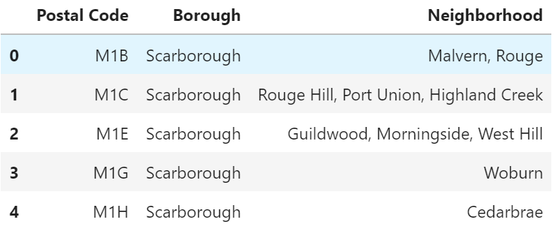

#### b. Filtering out the neighborhoods
Next, I decided as a tourist, I would be more interested in areas that the borough contains the word Toronto, thus, i filter those areas out. So the areas are namely, Downtown Toronto, East Toronto, West Toronto and Centeral Toronto. 

With the data that is left, I went ahead to use Foursquare API to retrieve information about the popular spots around these 4 borough of Toronto. The popular spots returned depends on the highest foot traffic and thus it depends on the time when the call is made. So we may get different popular venues depending upon different time of the day. The call returns a JSON file and we need to turn that into a data-frame. Here with the limit of 100 and a radius of 500, I have gotten the data of 238 unique category of venues . Below is the data-frame obtained from the JSON file that was returned by Foursquare —
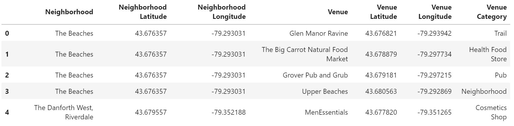

#### c. Finding out Popular sites near the neighborhood
Using the data given by Foursquare API, I have used one hot encoding to find out which venues are the most common areas that the residents likes and head there often. The results are as follows--
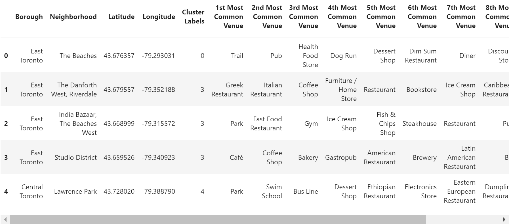
#### d. Popular site - Cafe
As I have decided that I'll be around the studio district, I went ahead to look at the most common venue, Cafe. With this I went on to Foursquare API again and search for the nearby Cafes in the area!
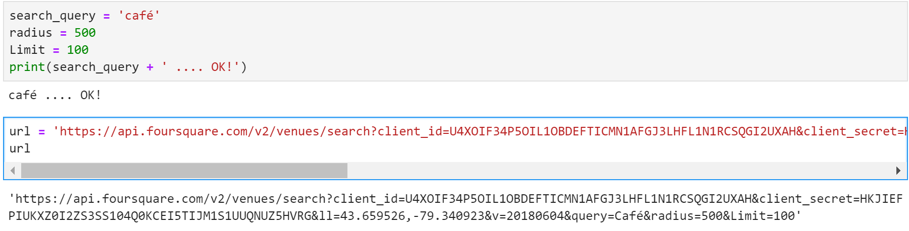
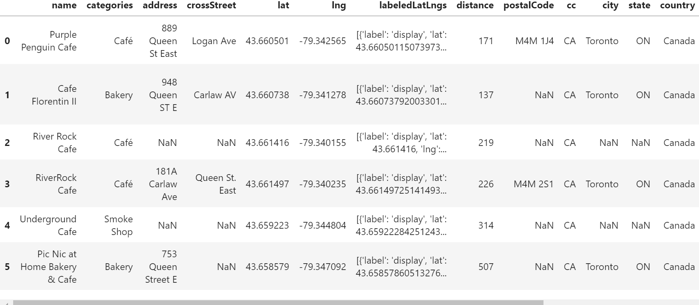
*Purple Pengiun Cafe* - well the name of the cafe definitely caught my eye! Let's check the review on it!
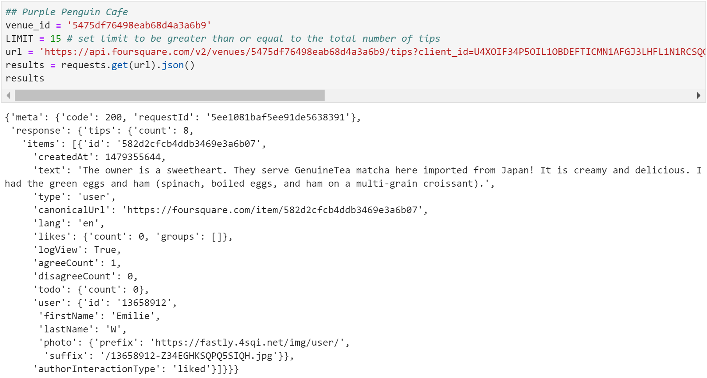
Good Review!! Let's go! But wait a minute! Let's first check out the neighborhood, if it is safe and worth going or if we should be more prepared before going. 

#### e. Toronto Police Service Public Data Portal
This dataset can be download from the <a href="http://data.torontopolice.on.ca/">Toronto Police Service Public Data Portal</a> and reflects reported incidents of crime (with the exception of murders where data exists for each victim) that occurred in the City of Toronto from 2014-2019, minus the most recent seven days. A full desription of the data is available on the site.

In order to protect the privacy of crime victims, addresses are shown at the neighborhood, Hood_ID. To learn more about the Hood_ID you can click <a href="https://www.toronto.ca/city-government/data-research-maps/neighbourhoods-communities/neighbourhood-profiles/">here</a>

<table>
  <tr>
    <th>Column Name</th>
    <th>Type</th>
    <th>Description</th>
  </tr>
  <tr>
    <td>Event Unique ID</td>
    <td>Text</td>
    <td>ID that is unqiue to the incident</td>
  </tr>
  <tr>
    <td>Occurrence date</td>
    <td>Date or Time</td>
    <td>Date and time when the incident occurred. this is sometimes a best estimate.</td>
  </tr>
  <tr>
    <td>Reported Date</td>
    <td>Date or Time</td>
    <td>When they recorded it, usually the same day.</td>
  </tr>
  <tr>
    <td>Premises Type</td>
    <td>Text</td>
    <td>Type of location that the crime take place. Eg. home, mall</td>
  </tr>
    <tr>
    <td>Offence</td>
    <td>Text</td>
    <td>what kind of offence they have commited</td>
  </tr>
    <tr>
    <td>reportedyear</td>
    <td>Number</td>
    <td>Which year was the crime reported</td>
  </tr>
    <tr>
    <td>reportedmonth</td>
    <td>Text</td>
    <td>Which month was the crime reported</td>
  </tr>
    <tr>
    <td>reportedday</td>
    <td>Number</td>
    <td>Which day was the crime reported</td>
  </tr>
    <tr>
    <td>reportedhour</td>
    <td>Number</td>
    <td>What time was the crime reported</td>
  </tr>
    <tr>
    <td>occurrenceyear</td>
    <td>Number</td>
    <td>which year did the crime happened on</td>
  </tr>
    <tr>
    <td>occurrencemonth</td>
    <td>Text</td>
    <td>Which month did the crime happened on</td>
  </tr>
    <tr>
    <td>occurenceday</td>
    <td>Number</td>
    <td>which day did the crime happened on</td>
  </tr>
    <tr>
    <td>occurrencedayofyear</td>
    <td>Number</td>
    <td>Out of 365 days, which day did the crime happen on</td>
  </tr>
    <tr>
    <td>occurrncedayofweek</td>
    <td>Text</td>
    <td>Which day of the week did the crime happen on</td>
  </tr>
    <tr>
    <td>occurrencehour</td>
    <td>Number</td>
    <td>At what hour did the crime happen on</td>
  </tr>
    <tr>
    <td>MCI</td>
    <td>Text</td>
    <td>Type of offence did they commit</td>
  </tr>
    <tr>
    <td>Division</td>
    <td>Text</td>
    <td>Which police division reported the crime</td>
  </tr>
    <tr>
    <td>Hood_ID</td>
    <td>Number</td>
    <td>Which part of toronto the crime happend in</td>
  </tr>
    <tr>
    <td>Neighbourhood</td>
    <td>Text</td>
    <td>Name of neighbourhood that the crime happened in</td>
  </tr>
    <tr>
    <td>Long</td>
    <td>Number</td>
    <td>Longitude of area that the crime take place</td>
  </tr>
    <tr>
    <td>Lat</td>
    <td>Number</td>
    <td>Latitude of area that the crime take place</td>
  </tr>
</table>

Not all of the attributes are required so on the following data was imported:

1. Event Unique ID
2. Date of Occurance
3. Offence
4. Occurrence year
5. Occurrence month
6. Occurrence day
7. Occurrence day of week
8. Occurrence hour
9. Hood_ID
10. Neighbourhood
11. Latitude
12. Longitude

A sample of the imported data is shown.
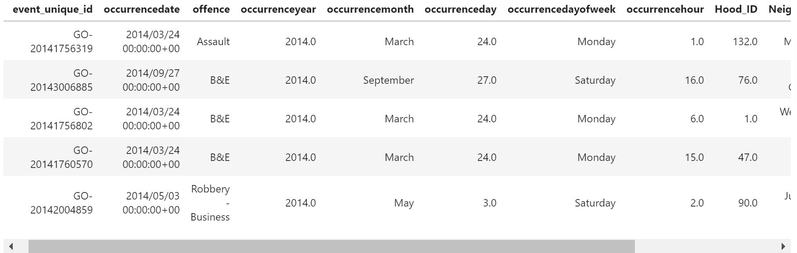

This data was then processed as follows:

1. Clean up the column names
2. Drop missing data
3. Sort data by months

### Data Analysis and Visualisation
After sorting out the data, let's now look at the top 3 most common crime in Toronto, Canada!
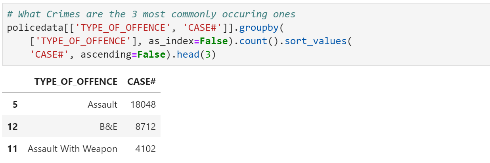
To better visualise the data and understand it, let us view it chart form. In the chart below, I have decided to use non-stacked charts to give a better visualisation on how the data is like. 
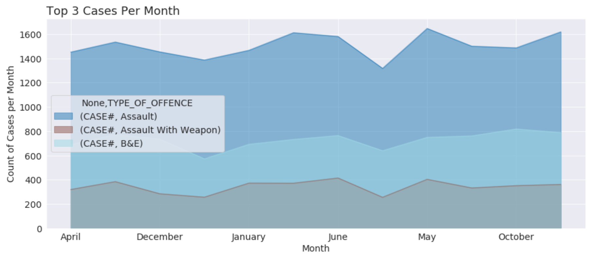
It can be seen that even though the top three crimes are *Assult, Break & Enter(B&E) and Assult with weapon(AW)*, **Assult** still takes the lead in showing that it has way more cases than the rest by occupying a bigger area in the chart.
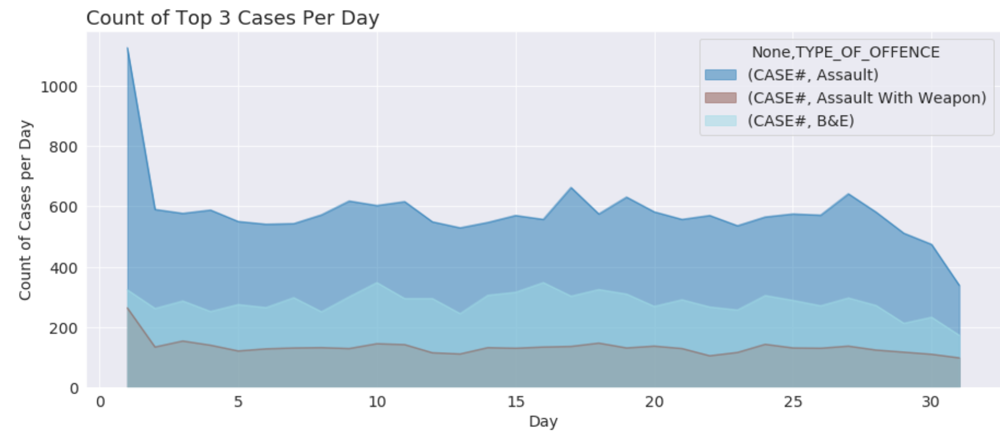
Looking at the top 3 crimes it is clearly visible that the occurances of Assults rise greatly during daylight hours and particularly dip only between the hours of 4AM to 6AM. While, Assult with weapon, has little to no fluctuation showing that the time does not matter that much to those that commit it.
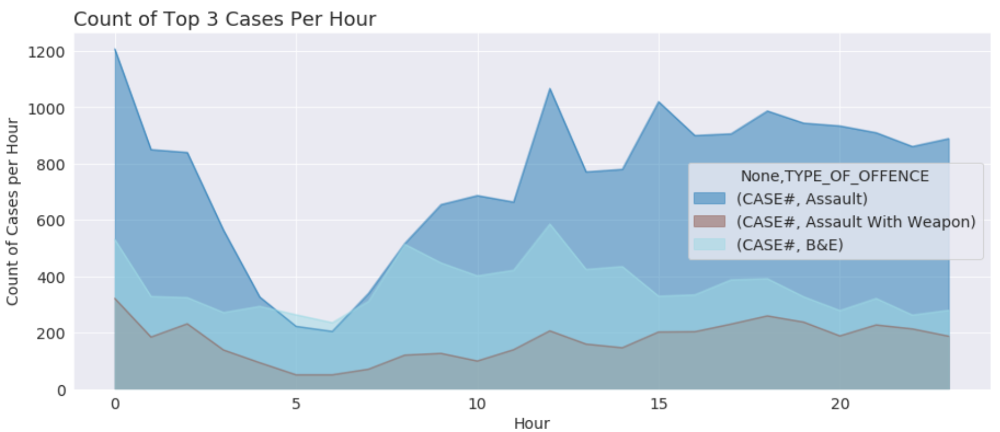
From the cases per day, it is obvious that more crime happened at the start on the month compared to the other days. Generally, the top 3 crimes looks like are fluctuation in the same motion despite the point that Assults have way more cases.

Looking at the Crime data for a single month, for example, *I am going Toronto in MAY*, let's look at how the top 3 crimes are spreaded out. It can be seen that various red and blue dots are spreaded out, showing many Assults and B&E respectively. While a few green dots appear around the area with a higher concentration of red and blue dots.
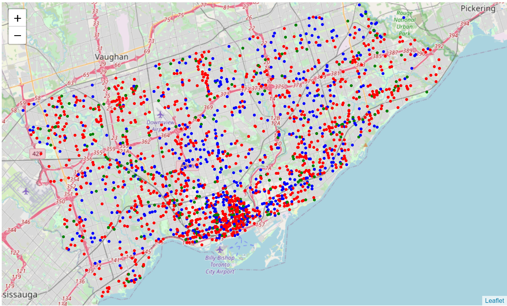
Creating the heat map, reinforces the cluster chart where the crime occurs. Generally, it seems like the crime are mostly all spread out, other than a few areas nearer to the aiport and the border that shows a greater density of crime happening shown in orange-yellow.
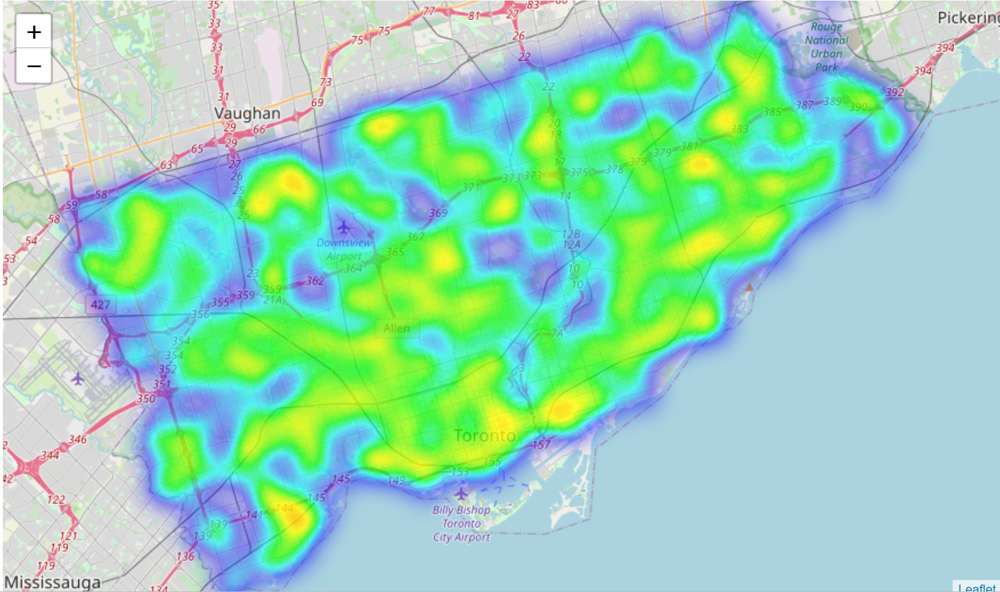
### Further Visualisation
Using the results from my Toronto Top Common Venues to input in the crime data heat map, let's see if I would need to take precaution when I head out!
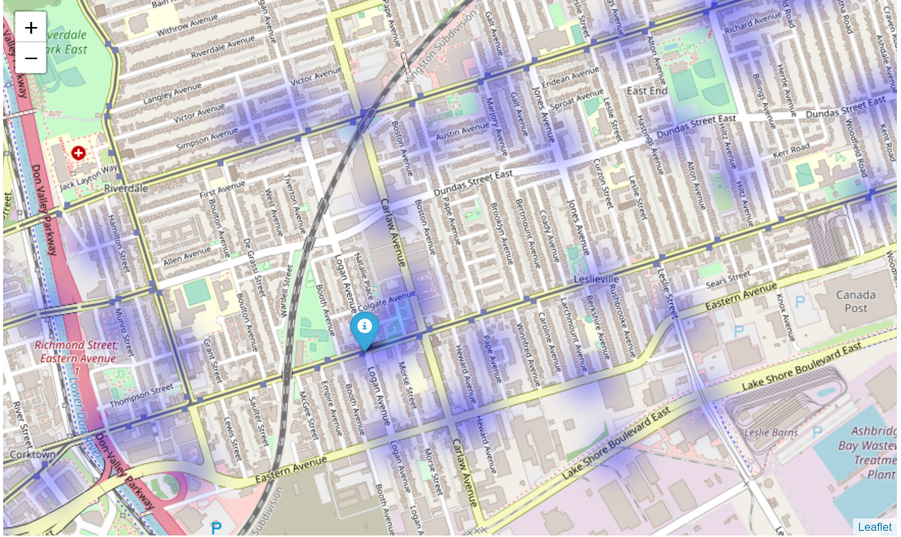
Visiting this venue appears to be a safe option with very little crime recorded in the immediate vicinity. 

### Conclusion and Discussion
The idea for the Capstone Project is to show that when driven by venue and location data from FourSquare, backed up with open source crime data, that it is possible to present the cautious and nervous traveller with a list of attractions to visit supplementd with a graphics showing the occurance of crime in the region of the venue.
A high level approach is as follows:

&#9745;The travellers decides on a city location 

&#9745;Wikipedia scraping of data for postal codes in Toronto

&#9745;From this list is augmented with additional grographical data

&#9745;Using this additional geographical data finding the top nearby restaurents are selects

&#9745;The historical crime within a predetermined distance of all venues are obtained

&#9745;A map is presented to the to the traveller showing the selected venues and crime statistics of the area.

??The future prediction of a crime happening near or around the selected top sites is also presented to the user

I have to declare that the prediction of crime rate happening around the area was clear as the data given by the Toronto police department shows a 4 year data set. The data set shows that in the 4 years, for the month of may, it is quite clear that which time/day/month has a dipped and rise in crimes. There were no ambiguity in the data that shows a flat line. Hence, taking the data as it is, I assume that, if everything else stays the same, the crime data in Toronto would not differ as much. 

Although most of the goals of this project were met, there is definitely room for further improvement and development as noted below. However, the goals of the project were met and, with some more work, could easily be devleoped into a fully phledged application that could support the cautious traveller in an unknown location.

Of the contributing data the Toronto Crime data is the one where more data would be good to have. Also not every city in the world makes this data freely available so that is a drawback.

FourSquare proved to be a good source of data but certain data such a top picks could not be drawn from a sandbox account. 
